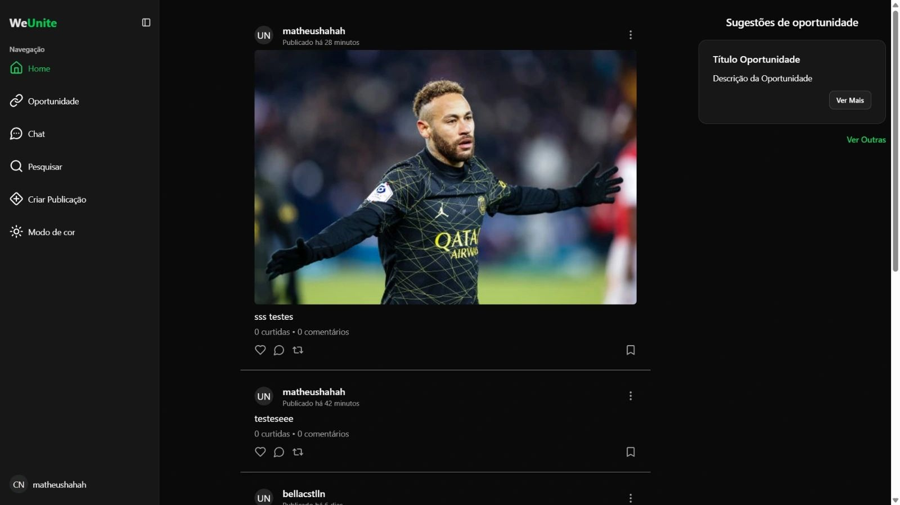

# 🚀 Portfolio

[](https://reactjs.org/)
[](https://www.typescriptlang.org/)
[](https://vitejs.dev/)
[](https://tailwindcss.com/)
[](https://ui.shadcn.com/)

A modern, responsive personal portfolio built with cutting-edge technologies. Showcase your skills, projects, and journey with a sleek design featuring dark/light theme toggle, internationalization, and smooth animations.

## ✨ Features

- 🌟 **Responsive Design**: Optimized for all devices with a neutral design and purple accents
- 🌓 **Theme Toggle**: Seamless light/dark mode with localStorage persistence
- 🌍 **Multilingual Support**: English and Portuguese translations with i18next
- ♿ **Accessibility First**: Built with accessibility in mind using Radix UI primitives
- 🎨 **Modern UI Components**: Reusable primitives powered by shadcn/ui and Radix
- 📱 **Interactive Sections**: About, Projects, Skills, Journey Timeline, and more
- ⚡ **Fast Performance**: Vite-powered build with optimized assets
- 🔧 **Developer Experience**: TypeScript, ESLint, Prettier, and Husky pre-commit hooks

## 🖼️ Screenshots



## 🛠️ Tech Stack

### Frontend Framework

- **React 19** - Latest React with concurrent features
- **TypeScript** - Type-safe development
- **Vite 7** - Lightning-fast build tool

### Styling & UI

- **Tailwind CSS v4** - Utility-first CSS framework
- **shadcn/ui** - Beautiful, accessible components
- **Radix UI** - Unstyled, accessible UI primitives
- **Lucide React** - Beautiful icons

### Internationalization

- **i18next** - Internationalization framework
- **react-i18next** - React integration

### Development Tools

- **ESLint** - Code linting
- **Prettier** - Code formatting
- **Husky** - Git hooks
- **TypeScript** - Type checking

## 🚀 Getting Started

### Prerequisites

- Node.js 18+
- npm or yarn

### Installation

1. **Clone the repository**

   ```bash
   git clone https://github.com/luizgusmao07/portfolio.git
   cd portfolio
   ```

2. **Install dependencies**

   ```bash
   npm install
   ```

3. **Start development server**

   ```bash
   npm run dev
   ```

4. **Open your browser**
   Navigate to `http://localhost:5173`

### Build for Production

```bash
npm run build
npm run preview
```

## 📁 Project Structure

```
src/
├── components/
│   ├── shared/          # Shared components (Section, SectionHeader)
│   ├── system/          # Feature components (Header, AboutMe, ProjectsSection, etc.)
│   └── ui/              # Reusable UI primitives (Button, Card, Dialog, etc.)
├── constants/           # App constants (navigation, projects, technologies)
├── hooks/               # Custom React hooks (useTheme, useLocalStorage, etc.)
├── i18n/                # Internationalization setup and locales
├── lib/                 # Utilities and domain logic
├── types/               # TypeScript type definitions
└── assets/              # Static assets
```

## 🎨 Customization

### Personal Information

Update your details in `src/constants/`:

- `navigation.ts` - Navigation links
- `projects.ts` - Your projects
- `technologies.ts` - Tech stack

### Styling

- Modify theme colors in `src/index.css`
- Customize components in `src/components/ui/`
- Adjust animations and transitions as needed

### Internationalization

Add new languages in `src/i18n/locales/` and update `src/i18n/constants.ts`

## 📜 Available Scripts

- `npm run dev` - Start development server
- `npm run build` - Build for production
- `npm run preview` - Preview production build
- `npm run lint` - Run ESLint
- `npm run lint:fix` - Fix ESLint issues
- `npm run format` - Format code with Prettier
- `npm run typecheck` - Run TypeScript type checking

## 🌐 Live Demo

https://portfolio-luiz-murex.vercel.app/

## 📄 License

This project is open source and available under the [MIT License](LICENSE).

## 🙏 Acknowledgments

- [shadcn/ui](https://ui.shadcn.com/) for the amazing component library
- [Radix UI](https://www.radix-ui.com/) for accessible primitives
- [Tailwind CSS](https://tailwindcss.com/) for the utility-first approach
- [Vite](https://vitejs.dev/) for the blazing fast build tool

---

**Built with ❤️ by [Luiz Gusmão](https://github.com/luizgusmao07)**
